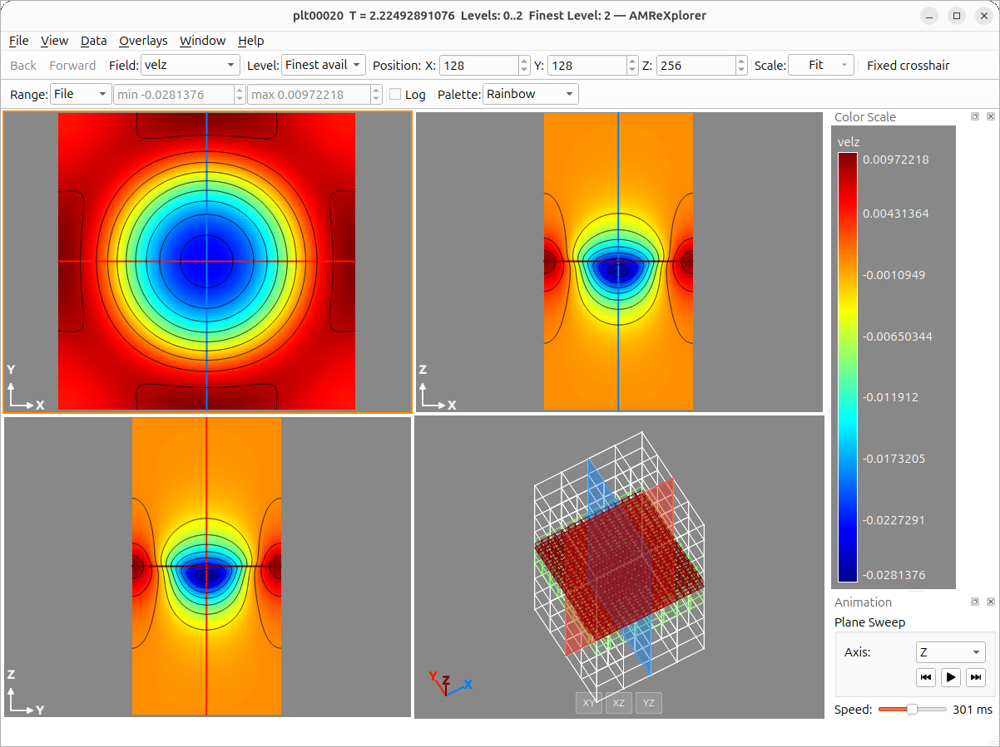

# AMReXplorer User Guide

AMReXplorer is an interactive viewer for two- and three-dimensional AMReX
plotfiles. It also opens standalone FAB and MultiFab data. This guide assumes
you are already familiar with AMReX plotfiles, variables, and refinement
levels.

For installation and build instructions, see
[INSTALL.md](https://github.com/amrex-codes/amrexplorer/blob/main/INSTALL.md).

## Getting started

Open a dataset from the command line:

```text
amrexplorer /path/to/plotfile
```

Pass two or more plotfile directories to open them as a time sequence:

```text
amrexplorer plt00000 plt00010 plt00020
```

You can also start without a path and use the File menu:

- **Open Plotfile Directory...** opens one AMReX plotfile.
- **Open Plotfile Sequence...** opens two or more plotfiles as animation
  frames.
- **Open FAB...** opens a raw FAB data file. If the file contains several
  concatenated FAB records, all records are available in the FAB Selector.
  Headerless `_D_*` files are supported when their companion `_H` file is
  present in the same directory.
- **Open MultiFab...** opens a standalone MultiFab header.
- **Open New Window** creates an independent viewer for side-by-side
  comparison.

Cylindrical RZ and 3-D spherical plotfiles open normally but are displayed on
their logical grid. **2-D spherical (r, θ)** plotfiles can also be shown in
true physical space — see [2-D spherical coordinates](#2-d-spherical-coordinates).

## Remote datasets

AMReXplorer can display plotfiles that live on another Linux machine, such as
an HPC login node. The client runs `amrexplorer-server` on the remote machine
through `ssh` and speaks its protocol over that ssh connection's own
input/output stream -- the way `git` and `sftp` work. No ports are opened on
either machine, no tunnel or port forwarding is involved, and the server exits
by itself as soon as the session ends. Give the client any destination that
works with the `ssh` command, including a hostname or alias from
`~/.ssh/config`:

```text
(local) $ amrexplorer --ssh user@remote-hostname /remote/path/plt00010
```

where `remote-hostname` is replaced with the actual remote hostname or alias.
Give several paths to play them as a sequence, or none to only establish the
session. The plotfile paths are named as they appear on the remote machine;
a leading `~/` expands to the home directory there, and a relative path is
resolved against it as well.

If `amrexplorer-server` is not on the non-interactive remote `PATH`, give its
path explicitly. Quote a home-relative path so `~` is expanded on the remote
machine rather than by the local shell:

```text
(local) $ amrexplorer --ssh remote-hostname --server "~/bin/amrexplorer-server" \
    /remote/path/plt00010
```

The client remembers the path for each destination, so `--server` is needed
only the first time; later connections to the same destination use it
automatically, from the CLI and the GUI alike.

The GUI equivalents are **File > Open Remote Plotfile...** and **File > Open
Remote Plotfile Sequence...**: one dialog asks for the SSH destination, the
server executable, and the plotfile path (or paths, one per line). The
connection fields are prefilled; leaving them unchanged opens further paths
over the current session, and entering a different destination starts a new
one. Once open, a remote dataset is driven exactly like a local one.

If the destination requires a password or keyboard-interactive MFA,
AMReXplorer opens a response dialog for each OpenSSH prompt, including the
first-connection host-key confirmation. Everything happens on one SSH
connection, so the session requires only one authentication flow and does not
rely on SSH multiplexing.

**Sharing the connection.** If `~/.ssh/config` sets `ControlMaster auto` and a
`ControlPath` for the destination, AMReXplorer's ssh becomes the master and a
later `ssh` to the same destination from a terminal rides on its connection.
Quitting AMReXplorer stops that ssh, which takes the master and every session
sharing it down too. To keep them, add `ControlPersist 10m` (or `yes`) to the
host's entry: OpenSSH then runs the master as a background process of its own,
so quitting AMReXplorer ends only its session, terminal sessions survive, and
the next AMReXplorer session reuses the connection without authenticating
again. With a duration the master closes that long after its last client
disconnects; with `yes` it stays until `ssh -O exit destination` or the
connection drops.

The client keeps the SSH process alive for the session and stops it when the
window closes; the server reads end-of-stream and exits, so nothing is left
running on the remote machine. The server binds no sockets at all in this
mode, and the session's access token is passed in memory rather than in a
process argument or shell history.

**Gateways and firewalls.** Because nothing is forwarded, the session needs no
port-forwarding permission from the remote sshd, and it works through a
bastion with `ProxyJump` in `~/.ssh/config` (or `ssh -J`) exactly as plain
`ssh` does. A gateway whose login script runs an inner `ssh` onward also works,
provided the script passes the remote command through (`exec ssh target
"$@"`); if it ignores the command and only opens an interactive shell, use a
`ProxyJump` alias instead.

**Windows.** Remote sessions are not available from a Windows client yet.

**Troubleshooting.**

- *"amrexplorer-server is installed in its PATH"*: the login shell on the
  remote machine could not find the server for a non-interactive command --
  ssh commands skip most of the shell start-up that builds an interactive
  session's `PATH`. Two fixes:
  - Pass the full path with `--server` (CLI) or in the open dialog's server
    field. It is remembered per destination, so this is a one-time entry.
  - Or make the server's directory reachable non-interactively: on the
    remote machine put the export at the *top* of `~/.bashrc`, before the
    interactivity guard (`case $- in ... esac` or `[ -z "$PS1" ] && return`)
    that most distributions ship -- lines below that guard never run for ssh
    commands. The example assumes `amrexplorer-server` is installed in
    `~/.local/bin`; use the directory it actually lives in:

    ```bash
    # ~/.bashrc on the remote machine, first line
    export PATH="$HOME/.local/bin:$PATH"
    ```

    Check with `ssh remote-hostname 'amrexplorer-server --help'`.
- *"unknown option: --stdio"*: the `amrexplorer-server` installed on the
  remote machine predates this client. Build and install a current one -- see
  [INSTALL.md](../INSTALL.md).
- The tail of the remote side's error output is included in the failure
  message, and the Diagnostics dock shows the session's state at any time.
- A shell startup file that prints output is harmless before the session
  starts (the client skips banners), but anything that writes to the
  command's standard output *after* startup -- a background job in `.bashrc`,
  for example -- corrupts the stream and ends the session.

**Slow links.** The server disconnects a client that stalls: by default it
allows 30 seconds with no write progress, and expects a response to average at
least 64 KiB/s. If a slow or intermittent link keeps dropping the connection,
relax both limits with a small wrapper script on the remote machine and pass
it as the server executable:

```text
(remote) $ cat > ~/bin/amrexplorer-server-slow <<'EOF'
#!/bin/sh
exec amrexplorer-server --write-stall-timeout-seconds 120 \
    --write-min-kib-per-second 8 "$@"
EOF
(remote) $ chmod +x ~/bin/amrexplorer-server-slow
(local)  $ amrexplorer --ssh remote-hostname \
    --server "~/bin/amrexplorer-server-slow" /remote/path/plt00010
```

## User interface overview



The main controls are:

1. **Field and Level** select the plotted variable and AMR composition.
2. **3D Position** selects the sample index of each orthogonal slice plane.
3. **Scale** resets the zoom to the whole domain (Reset Zoom), uses a fixed
   integer zoom, and controls whether rubber-band zoom is synchronized across
   3-D panels.
4. **Range, Log, and Palette** control the mapping from values to colors.
5. **Slice panels** display the XY, XZ, and YZ planes for a 3-D dataset.
6. **Isometric view** shows the domain, grid boxes, and current slice planes.
7. **Color Scale** reports the active value-to-color mapping.
8. **Animation** controls a 3-D plane sweep or an open plotfile sequence.

Use **View** to show or hide toolbars and dock panels. Docks can be moved,
detached, resized, and placed on another side of the main window. **View** also
holds the overlays drawn on top of the slice: grid boxes, contours and vectors,
and particles.

## Inspecting standalone FABs and MultiFabs

Opening a raw FAB file displays its first record and opens the **FAB Selector**
dock. Use its filter and table to find a record, then double-click it or press
**View FAB**. The table shows the record offset, stored box, component count,
index type, and floating-point precision.

Opening a standalone MultiFab also opens the selector, with one row for every
FAB across all of its data files. The MultiFab view excludes ghost points, as
usual. Selecting **View FAB** switches the same window to that FAB and displays
its complete stored box, including points that were ghosts in the MultiFab. Use
**Back to MultiFab** to restore the previous MultiFab field, level, slice
positions, and view regions.

FAB mode uses the range of the complete selected FAB for **File** range, so the
colors do not change when a 3-D slice is moved or the view is zoomed or panned.

Cell-centered and nodal index types are honored independently in each
direction, so coordinates, slice positions, probing, and panning follow the
sample locations recorded by the FAB or MultiFab.

## A basic 2-D workflow

1. Open a plotfile and choose a field from the **Field** control or
   **Variable** menu.
2. Choose **Finest available** to composite AMR levels, or choose an exact
   level when you need to inspect that level alone.
3. Left-drag around a region to zoom into it. **Scale > Sync Rubber-band
   Zoom** applies that normalized region to every 3-D panel and is enabled by
   default. Use the mouse wheel for additional panel-local display zoom.
4. Left-click a sample to inspect its coordinates, indices, level, and value in
   the status area.
5. Select an appropriate **Range** mode and palette.
6. Add grid boxes, contours, vectors, or line plots as needed.
7. Use **File > Export Image...** to save the current view.

Double-click a view, press **0**, or select **Reset Zoom** to return to the
full domain.

## Navigating and inspecting data

The active panel is the one most recently clicked or manipulated.

| Input | Action |
| --- | --- |
| Left click | Probe the value under the cursor |
| Left drag | Zoom to a rectangular subregion; optionally sync all 3-D panels |
| Shift+left drag | Pan the view |
| Arrow keys | Pan the focused panel by 5 percent (click a panel to focus it) |
| Mouse wheel | Zoom only the panel under the pointer |
| Double click | Reset the zoom to the whole domain |
| Shift+middle click | Plot a horizontal line through the selected sample |
| Shift+right click | Plot a vertical line through the selected sample |
| Right drag | Plot a line; the drag direction chooses the orientation |
| Right click in a 3-D slice | Move the other two slice planes to the clicked point |

The **Scale** control offers fixed zooms from 1x to 32x, where the factor is
screen pixels per finest-level cell. A very wide local domain cannot be shown
at finest resolution all at once, so the requested factor may not be reachable;
the Scale button then reports what it applied, such as `32x→16x`. Rubber-band
zoom is unaffected: selecting a subregion re-reads that region at finest
resolution.

The line-plot window can accumulate curves, which is useful when comparing
variables, levels, or positions. Its horizontal axis uses physical coordinates
for plotfiles and integer indices for standalone FABs and MultiFabs.

Choose **View > Dataset...** or press **Ctrl+D** to inspect raw values for
the visible physical region. Values are grouped by AMR level. Clicking a
value highlights the corresponding sample in the main view.

Choose **View > Number Format...** to set the `printf`-style format used for
numeric readouts. The default is `%g`.

## Working with 3-D data

A 3-D dataset is shown as three orthogonal slices:

- **XY** has a fixed Z position.
- **XZ** has a fixed Y position.
- **YZ** has a fixed X position.

Change a plane with the X, Y, and Z index controls in **3D Position**. A right
click in any slice moves the other two planes so that all three intersect at
the selected point. Crosshairs and the isometric view show their shared
location.

Each slice panel can be navigated independently. Field, level, range,
logarithmic mapping, and palette are shared so the three panels remain
directly comparable.

The **Plane Sweep** controls in the Animation panel select an axis and step or
play through its sample indices. The speed slider controls the delay between
frames.

## Selecting fields and AMR levels

Select a field from the toolbar or the **Variable** menu.

The level controls offer:

- **Finest available** composites data from level 0 through the finest level
  that can be loaded.
- **Levs 0-N** composites levels 0 through N.
- **Level N** displays only exact level N data.

A composite uses fine data where it exists and coarser data elsewhere; an
exact-level view is useful for checking one level's coverage and values.

Useful shortcuts are:

| Shortcut | Level selection |
| --- | --- |
| Ctrl+0 | Finest available composite |
| Ctrl+1 through Ctrl+9 | Composite levels 0 through N |
| Alt+0 through Alt+9 | Exact level N |

## Ranges, logarithms, and palettes

The **Range** control determines which values map to the ends of the color
scale:

- **File** uses the range over the full dataset.
- **Level** uses the selected level or composite.
- **Visible** derives the range from slice data. After a full-domain slice is
  loaded, its range remains stable while you zoom and pan.
- **User** enables explicit minimum and maximum values.

If the input does not provide complete range statistics, **File** and
**Level** are unavailable and AMReXplorer uses **Visible** instead.

Range settings are remembered separately for each field while the dataset is
open. In 3-D, all three slice panels share one range.

Enable **Log** for logarithmic color mapping. The displayed range must have a
positive minimum. If it does not, AMReXplorer falls back to linear mapping and
turns **Log** off; use a positive user minimum when necessary.

Built-in palettes include rainbow, turbo, viridis, plasma, parula, coolwarm,
and blackbody. Use **View > Palette > Load Palette File...** to load a custom
`.pal` file. **View > Palette > Reverse Colormap** flips the selected palette's
color ramp (the "_r" variant, e.g. plasma_r) and stays applied as you switch
between palettes.

## Grid boxes, contours, and vectors

Press **B** or choose **View > Boxes** to show AMR grid boundaries.

Choose **View > Contours...** to select one of three display modes:

- **Raster** shows the color-mapped slice only.
- **Raster & Contours** overlays contour lines on the raster.
- **Velocity Vectors** overlays vector glyphs.

For contours, choose the number of lines and their color. For vectors, select
the U and V components for 2-D data, and the U, V, and W components for 3-D
data. AMReXplorer may propose fields based on common velocity names; verify the
component selections for your dataset.

## Particles

Plotfiles that carry particle data can draw it over the slice. Choose **View >
Particles...** — the item is enabled only while the open dataset has at least
one particle species.

The dialog lists every species with its particle count and three controls
each:

- **Show** draws that species, or hides it.
- **Color** picks the point color. Each species starts with a distinct default.
- **Alpha** sets opacity from 0 to 100 percent.

Below the species list are three settings that apply to all of them:

- **Visible subset** is the percentage of particles drawn, from 0.01 to 100.
- **Sampling seed** chooses *which* particles the subset contains. Change it to
  look at a different sample of the same size.
- **Point size** is the drawn diameter in pixels, from 1 to 12.

The same particles stay selected as you step through the frames of a sequence,
and for a given seed a lower percentage thins the same set of particles rather
than replacing it.

For 3-D data, particles are projected onto each of the three orthogonal slice
panels. The projection is through the whole volume: a panel shows every selected
particle, not only those near that slice plane.

Particle settings are not saved between sessions. Species selection, colors,
subset percentage, seed, and point size all reset when a new dataset or sequence
is opened; they carry across the frames of an open sequence.

## 2-D spherical coordinates

A 2-D plotfile whose Header records the spherical coordinate system stores its
data on a logical (r, θ) grid, where r is the radius and θ the polar angle from
the vertical axis. AMReXplorer can present it three ways, chosen under **View >
2-D Spherical > Display**:

- **R-Z (physical)** — the default. The (r, θ) data is warped into the physical
  wedge it represents, with R = r·sin θ horizontal and Z = r·cos θ vertical, so
  cell boundaries appear as circular arcs and radial lines. Overlays and the
  coordinate readout follow the warp; the readout reports both physical (R, Z)
  and native (r, θ).
- **r-θ** — the logical grid drawn directly, r horizontal and θ vertical.
- **θ-r** — the same logical grid transposed, θ horizontal and r vertical.

**View > 2-D Spherical > Supersampling** sets how finely the logical grid is
resampled for the R-Z view (1x–16x); higher factors trace the curved cell
boundaries more smoothly at the cost of a larger image.

Vector glyphs are available in all three layouts. In the R-Z view each arrow is
anchored at its physical position and the (v_r, v_θ) components are rotated
into physical directions. Line plots and particle overlays are available in the
r-θ and θ-r layouts but not in the R-Z view.

## Plotfile sequences and animation

Open two or more plotfile directories with **File > Open Plotfile
Sequence...** or pass them on the command line. The Animation panel then
provides:

- a frame slider and frame number,
- the current plotfile name and simulation time,
- previous, play/pause, and next controls,
- a playback speed control.

Frame changes preserve the active field, level, range, log, palette, and
visible region when those settings remain valid for the next plotfile.
AMReXplorer refits the view when the new frame's geometry is no longer
compatible with the previous one.

## Exporting images and animations

**File > Export Image...** saves the current view as either a PNG display image
or a float64 FITS data image. PNG export asks whether to include the color
scale. FITS export writes the displayed scalar samples with `BITPIX=-64`;
invalid samples are written as NaN. A 2-D export creates one image. A 3-D
export creates separate `_xy`, `_xz`, and `_yz` images. Both formats reflect
the current zoomed data region; only PNG includes visible overlays and the
optional color scale.

For an open plotfile sequence, **File > Export Animation...** writes numbered
PNG frames. If `ffmpeg` is installed and available on `PATH`, AMReXplorer also
encodes an MP4. Three-dimensional sequences produce separate output for each
orthogonal plane.

## Panels, preferences, and diagnostics

The **View** menu controls these optional panels:

- **Dataset Metadata** shows plotfile geometry, levels, variables, and related
  metadata.
- **Color Scale** shows the current numeric range and palette.
- **Diagnostics** reports request, I/O, and cache activity.
- **Animation** contains plane-sweep and sequence controls.
- **FAB Selector** lists raw FAB records or the FABs belonging to an open
  standalone MultiFab.

Window geometry, logarithmic mapping, palette, number format, and animation
speed persist across sessions.

Each open dataset has a 1 GiB data cache by default. Set
`AMREXPLORER_CACHE_SIZE_MB` to a positive number of MiB before launching to change
the initial budget:

```text
AMREXPLORER_CACHE_SIZE_MB=2048 amrexplorer /path/to/plotfile
```

Independent windows have independent datasets, caches, and view state.

## Keyboard and mouse quick reference

| Shortcut | Action |
| --- | --- |
| B | Toggle AMR grid boxes |
| 0 | Reset the zoom to the whole domain |
| 1 through 6 | Use fixed scales from 1x through 32x |
| Ctrl+0 | Composite the finest available level |
| Ctrl+1 through Ctrl+9 | Composite levels 0 through N |
| Alt+0 through Alt+9 | Show exact level N |
| Ctrl+D | Open the Dataset window |

The same interaction summary is always available from **Help > Keyboard &
Mouse...**.

## Troubleshooting

**The plotfile does not open.** Verify that the selected directory contains a
valid AMReX `Header` and its `Level_N` directories. For a sequence, every
selected path must be a plotfile.

**An initial slice reports an unsupported data format.** AMReXplorer supports
IEEE-32 and IEEE-64 FAB floating-point payloads. Integer FAB payloads and other
floating-point layouts are not supported.

**The finest level cannot be displayed.** The composite may exceed the cache
budget. Increase `AMREXPLORER_CACHE_SIZE_MB`, reduce the visible region, or select a
lower composite maximum level.

**Log turns itself off.** The selected range has a nonpositive minimum, so
AMReXplorer has fallen back to linear mapping. Select a user range with a positive
minimum and verify that the field contains positive values.

**MP4 export is skipped.** Install `ffmpeg` and make sure the executable is on
`PATH`. The PNG frames are still written.

**Controls or panels are missing.** Use the **View** menu to restore hidden
toolbars and dock panels.
